## [Goodle Sheets](https://docs.google.com/spreadsheets/d/1jozMd5LzODdgULaUHlD5aDfX0rAdbuR_ZL9P_WURrBw/edit?usp=sharing)

#### развертывание:

```
docker compose up -d
```

## Кэширование в redis
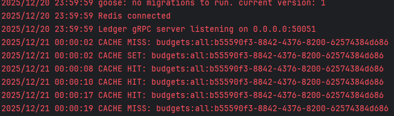
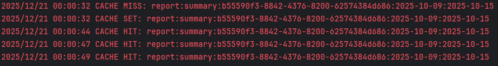


### Swagger - http://localhost:8080/swagger/index.html

### Для работы в таблице необходимо вставить адрес из tuna в config (не было возможности развернуть на сервере)

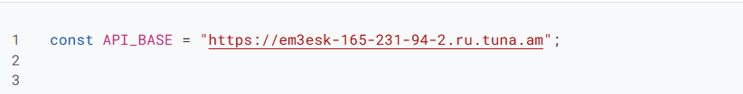
---

#### Авторизация и регистрация 


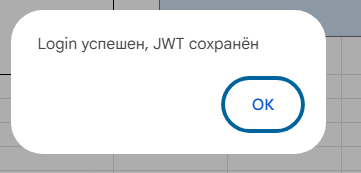
---

#### Добавление транзакций (при заполнении автоматически ставиться NEW)

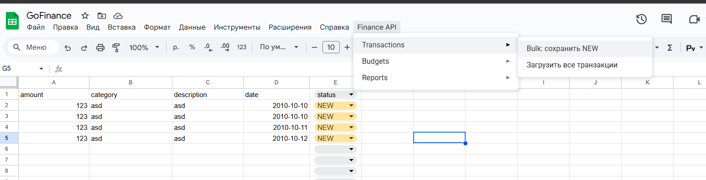
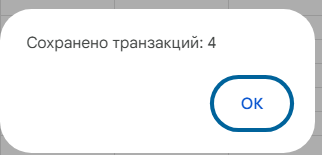
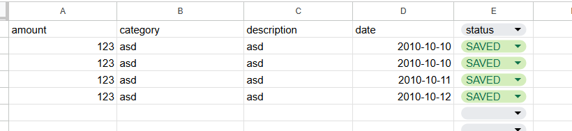


---

#### Загрузка всех транзакций
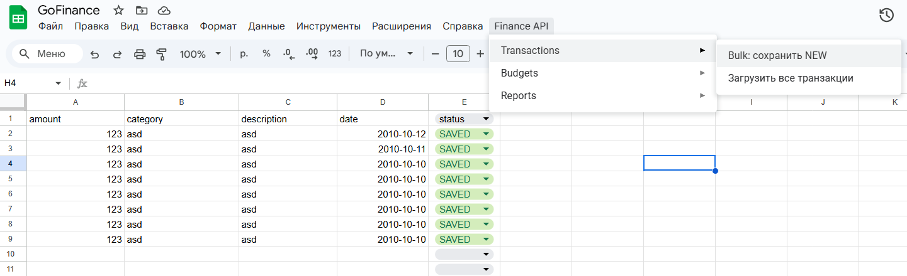

---

#### Невалидные значения
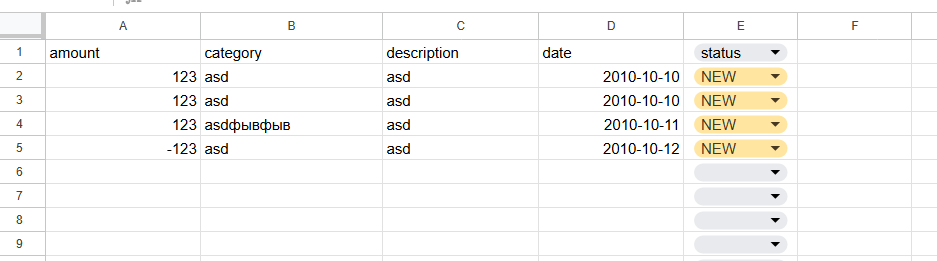
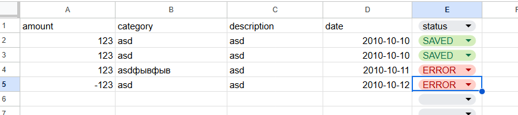

---
#### Добавление бюджетов (при заполнении автоматически ставиться NEW)
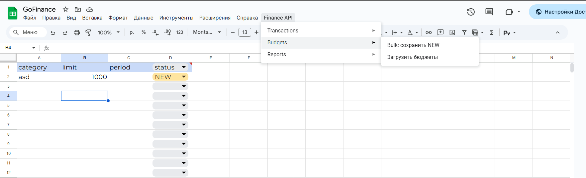
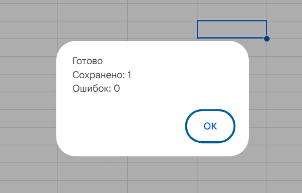
---
#### Неправильные значения
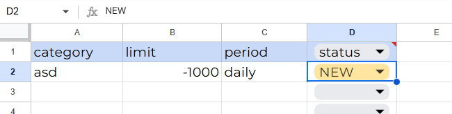
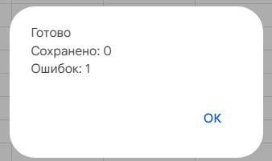
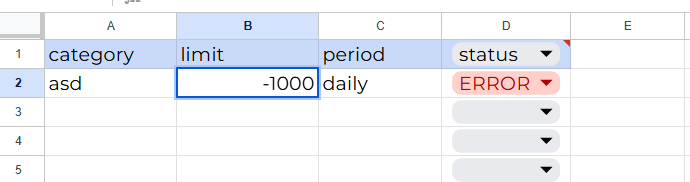

---

#### Загрузка всех бюджетов 

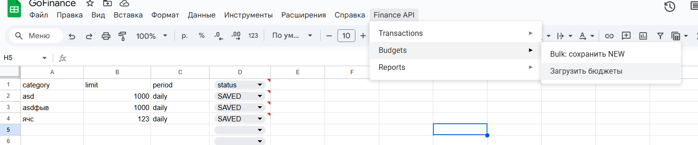

---

#### Вывод отчетов по периодам 

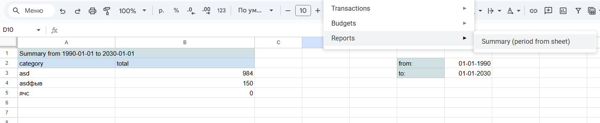
